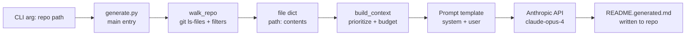

# 📝 ReadmeForge

## What This Project Does

- **Generates portfolio-quality READMEs from any codebase.** Point it at a local repo and it produces a structured, opinionated README.md that explains architecture, tradeoffs, and limitations — not just usage.
- **Respects your `.gitignore` automatically.** Uses `git ls-files` when available so it never wastes tokens on `node_modules`, build artifacts, or virtualenvs.
- **Prioritizes the files that actually matter.** A scoring pass pushes entry points (`main.py`, `package.json`, `Dockerfile`) to the top of the prompt and trims low-signal files when the context budget is tight.
- **Enforces a fixed README schema via prompt engineering.** The system+user prompt locks Claude into a 15-section template with badges, a Mermaid diagram, and an honest "Limitations" section — no marketing fluff.


## The Problem

Most developers write bad READMEs — or no README at all. The friction is real: a good README requires you to step out of implementation mode, think about your project from a stranger's perspective, draw a diagram, list tradeoffs honestly, and follow some consistent structure. By the time the project works, the motivation to do all of that is gone.

Existing tools fall into two unsatisfying buckets. Template generators (`readme-md-generator`, GitHub's built-in template) give you headings but no content — you still have to write everything. Generic "summarize my repo with AI" scripts produce shapeless prose that reads like marketing copy: lots of "robust" and "scalable," no diagrams, no honest limitations, no architecture. ReadmeForge sits in the middle: it reads the actual code, but it constrains the model to a strict schema that mimics what a senior engineer would write for their portfolio.

## Architecture



## Tech Stack

| Layer | Tool | Why |
|-------|------|-----|
| Language | Python 3.10+ | Standard for AI/LLM scripting; `pathlib` and `subprocess` make filesystem + git work trivial. |
| LLM client | `anthropic` SDK | Direct access to Claude with a clean message API; the 200K context window is essential for whole-repo prompts. |
| Model | `claude-opus-4-7` | Opus tier gives the writing quality needed for portfolio output; lighter models produce generic prose. |
| Repo enumeration | `git ls-files` via `subprocess` | Free `.gitignore` compliance — no need to re-implement ignore rules. Falls back to `rglob` for non-git directories. |
| Config | `python-dotenv` | Keeps `ANTHROPIC_API_KEY` out of source control without ceremony. |
| Path handling | `pathlib` | Cross-platform path math and globbing without string concatenation. |

## Quickstart

1. **Prerequisites:** Python 3.10+, an Anthropic API key, and `git` on your PATH (optional but recommended).

2. **Clone the repo:**
   ```bash
   git clone https://github.com/yourname/readmeforge.git
   cd readmeforge
   ```

3. **Create a virtualenv:**
   ```bash
   python -m venv .venv
   source .venv/bin/activate   # Windows: .venv\Scripts\activate
   ```

4. **Install dependencies:**
   ```bash
   pip install anthropic python-dotenv
   ```

5. **Set your API key:**
   ```bash
   echo "ANTHROPIC_API_KEY=sk-ant-..." > .env
   ```

6. **Run it against any local repo:**
   ```bash
   python generate.py ~/code/my-project
   ```

7. **Read the output:** A file named `README.generated.md` will appear in the target repo's root. Review it, rename to `README.md` if you're happy, and commit.

## Project Structure

```
readmeforge/
├── generate.py          # Single-file entry point: walks repo, builds prompt, calls Claude
├── .env                 # ANTHROPIC_API_KEY (gitignored)
└── README.md            # This file
```

The entire tool is one file by design — there's no plugin system, no class hierarchy, no abstraction overhead. The interesting complexity lives in the prompt template, not the Python.

## How It Works

### 1. Walking the repository (`walk_repo`)

The function first tries `git ls-files --cached --others --exclude-standard`, which returns every tracked file plus every untracked-but-not-ignored file. This is the easiest way to honor `.gitignore` without parsing it ourselves. If the directory isn't a git repo, it falls back to `pathlib.Path.rglob("*")` and applies a hardcoded `SKIP_FOLDERS` set as a safety net.

Each candidate path is then filtered three ways: extension must be in `RELEVANT_EXTENSIONS` (source code and config formats), no path component may be in `SKIP_FOLDERS` or start with a dot, and file size must be under `MAX_FILE_SIZE` (50KB). Anything that survives gets read as text with `errors="ignore"` so binary files or odd encodings don't crash the run.

### 2. Prioritizing files (`build_context`)

Naively concatenating files would either blow the context budget or randomly omit important ones. So `build_context` sorts files by a priority tuple: anything whose filename is in `PRIORITY_FILENAMES` (entry points, manifests, Dockerfiles) gets priority 0, everything else gets `(1 + depth, path)`. The result is that root-level entry points come first, then shallow files, then deep utilities.

| Priority | What gets ranked here |
|----------|-----------------------|
| 0 | `README.md`, `package.json`, `pyproject.toml`, `main.py`, `Dockerfile`, etc. |
| 1+depth | Everything else, with shallower paths winning |

Files are then concatenated in priority order until `MAX_CONTEXT_CHARS` (200K) is exhausted. Anything that doesn't fit is dropped with a count printed to stdout, so you can see how much was truncated.

### 3. Calling the model

The system prompt is short — it just sets the voice ("senior software engineer, confident but humble, no marketing fluff"). The heavy lifting happens in the user prompt, which is a ~2KB template defining all 15 sections, their order, formatting rules (badges syntax, Mermaid block, table columns), and quality rules ("no placeholder text," "use REAL filenames"). The repo context is interpolated at the end.

This is the key insight: the model already knows how to write every individual section of a good README. The prompt's job isn't to teach it, it's to *constrain* it into a consistent shape so the output looks like a deliberate document instead of LLM stream-of-consciousness.

### 4. Writing the output

The response text is written to `README.generated.md` inside the target repo (not the readmeforge directory). The `.generated` suffix is intentional — it prevents accidentally overwriting an existing README and signals to the user that this is a draft to review, not final output.

## Configuration

| Parameter | Default | Description |
|-----------|---------|-------------|
| `RELEVANT_EXTENSIONS` | `.py, .js, .ts, .tsx, .jsx, .md, .json, .toml, .yaml, .yml, .txt, .sh, .rs, .go, .rb, .java` | File types included in the prompt context. |
| `MAX_FILE_SIZE` | `50_000` bytes | Skip individual files larger than this (lockfiles, generated code). |
| `MAX_CONTEXT_CHARS` | `200_000` | Total character budget for repo content in the prompt. |
| `SKIP_FOLDERS` | `node_modules, venv, dist, build, .git, ...` | Folders pruned during traversal. |
| `PRIORITY_FILENAMES` | `README.md, package.json, main.py, ...` | Files pushed to the front of the prompt regardless of depth. |
| Model | `claude-opus-4-7` | Anthropic model used; swap for Sonnet to cut cost ~5x. |
| `max_tokens` | `8192` | Output ceiling — detailed READMEs typically run 2500-4000 tokens. |

## Advantages

- **Single-file simplicity.** The entire tool is ~150 lines of Python with two dependencies. You can read it in five minutes and modify it for your own taste.
- **Honors `.gitignore` for free.** By shelling out to `git ls-files`, ReadmeForge automatically skips whatever your repo already excludes — no parallel ignore configuration to maintain.
- **Schema-locked output.** Because the prompt enforces an exact 15-section structure, every README from this tool looks deliberate and comparable, not like random LLM prose.
- **Honest limitations section by default.** The prompt explicitly requires a "Limitations & Drawbacks" section with as many entries as the "Advantages" — this is what separates portfolio writing from marketing.
- **Context-budget aware.** The priority-sort + char-budget pass means it works on large repos without silently truncating the most important files.

## Limitations & Drawbacks

- **No incremental updates.** Each run regenerates the README from scratch. If you've hand-edited sections, your edits are lost — there's no diff/merge step.
- **Single-shot prompt, no validation.** The output isn't parsed or checked. If Claude drops a section or hallucinates a filename, you only find out by reading the result. A production version would validate the markdown structure and retry missing sections.
- **Char-budget is crude.** The 200K cap is measured in characters, not tokens, and doesn't account for the prompt template overhead. On dense code it slightly under-utilizes the context window; on sparse code it could theoretically overflow.
- **Won't read binary or notebook files.** `.ipynb` notebooks, images, and proprietary formats are skipped entirely, so projects that live inside Jupyter get an incomplete picture.
- **Opus is expensive.** A medium-sized repo run costs roughly $0.30–$1.00 per README. Batching across many repos adds up; switching to Sonnet would help but reduces writing quality noticeably.
- **No retry or streaming.** A network hiccup mid-call loses the whole run. Production use would need `tenacity` retries and probably streaming output so the user sees progress.

## What I Learned

- **Prompt structure matters more than prompt length.** My first version was a vague "write a great README" — the output was forgettable. Locking in 15 numbered sections with explicit formatting rules produced dramatically better results from the same model.
- **Asking the model for honest weaknesses requires explicit permission.** LLMs default to flattery. The prompt rule "equally many honest limitations" was the single highest-leverage change in the whole template.
- **`git ls-files` is underrated.** I started by reimplementing `.gitignore` parsing and realized halfway through that git already does this perfectly. Shelling out was 4 lines and zero edge cases.
- **Priority sorting beats summarization for context packing.** I considered summarizing each file before concatenating, but a simple priority-by-filename sort gave the model the right files in the right order with no preprocessing latency.
- **One file is a feature.** I almost split this into `walker.py`, `prompt.py`, `client.py`. Keeping it as one file means anyone can fork it and tweak the prompt without learning my abstractions — which is the whole point for a tool like this.

## Roadmap

- [ ] Validate generated markdown against the required schema and auto-retry missing sections
- [ ] Add `--model` flag to switch between Opus, Sonnet, and Haiku from the CLI
- [ ] Stream output to stdout while generating instead of waiting for the full response
- [ ] Support `.ipynb` notebooks by extracting markdown + code cells
- [ ] Add a `--merge` mode that preserves hand-edited sections via section-level diffing
- [ ] Token-accurate budgeting using `tiktoken` or Anthropic's token counter
- [ ] GitHub Action wrapper that regenerates READMEs on every push to `main`
- [ ] Optional second pass that critiques and revises its own output

## License

MIT.
